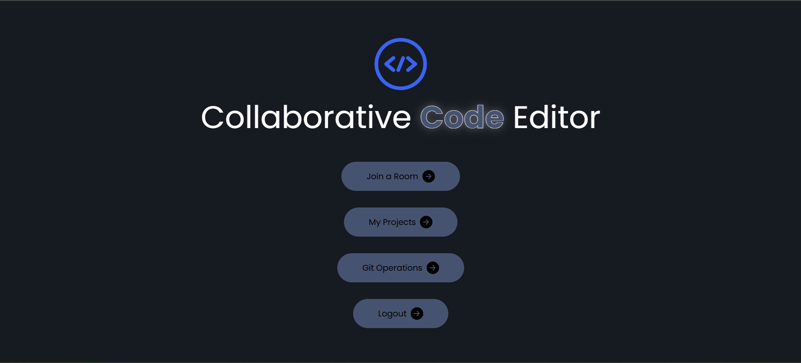
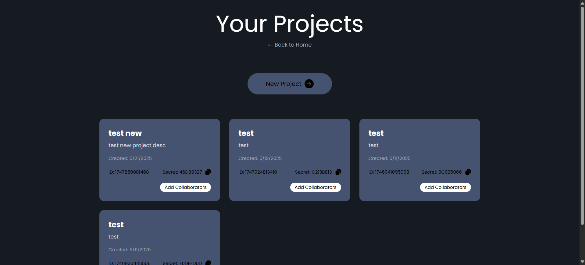
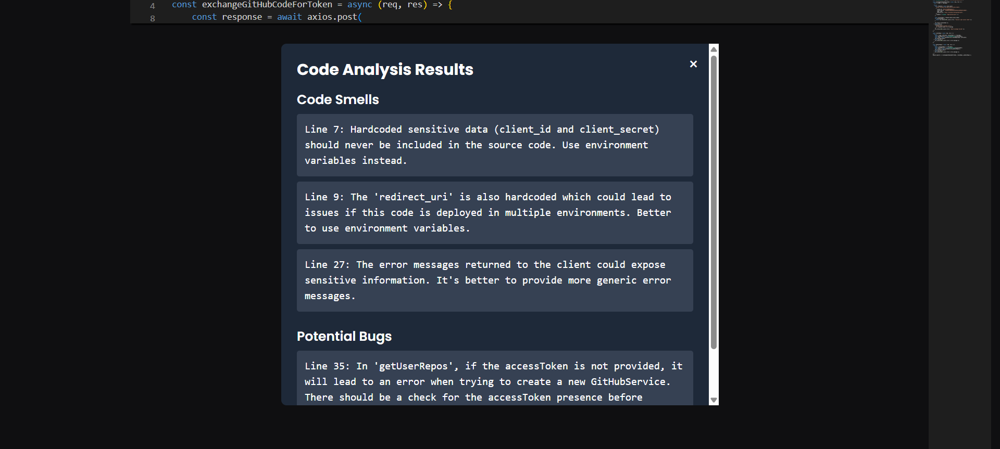
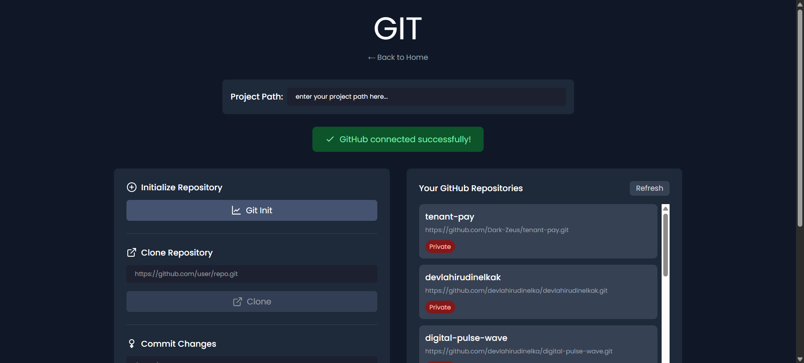
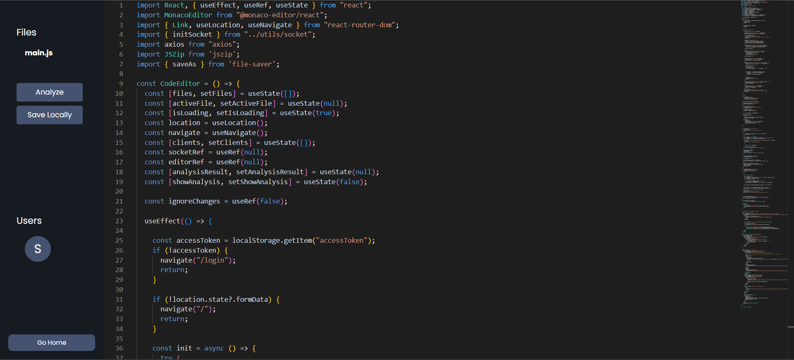
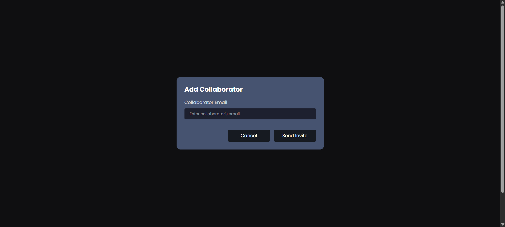
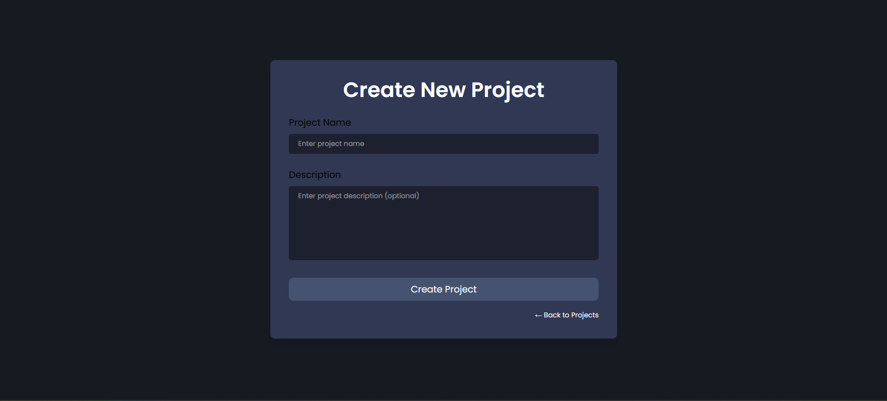

# 🧠 Collaborative Code Editor with Agentic AI Analysis

A full-stack MERN + Python (Phidata) project showcasing a real-time collaborative code editor with advanced AI-driven code analysis. This platform enables multiple users to edit the same file simultaneously while offering owner-only GitHub version control and integrated agentic AI support for smart debugging, error detection, and code quality insights.

> 🚀 **This project demonstrates my skills in full-stack development, real-time communication, AI integration, authentication, and UI/UX design.**

---

## 🔍 Features

### 💬 Real-Time Collaboration
- Real-time code synchronization using **Socket.IO**
- Multiple users can edit the **same file simultaneously**
- Built-in **Monaco Editor** with enhanced dark theme and syntax highlighting

### 🔐 Secure Authentication
- **JWT-based authentication** system to ensure secure user sessions
- Project-level access: only the **owner** can manage version control and GitHub integration

### 🧠 Agentic AI System (via Python + Phidata)
- Smart AI agents analyze code for:
  - 🔍 Error detection
  - 🧹 Code smells
  - 🐞 Bug identification
- Seamless integration with backend to provide **real-time code insights**

### 🗃️ GitHub Integration
- Version control via **SimpleGit**
- Only the project **owner** can push or pull to the GitHub repository

### 💾 Local File Storage
- Users can **save code locally** with automatic syncing
- Helps preserve code progress in real-time even before commit

### 🎨 Intuitive UI/UX
- Clean, **dark-themed interface**
- Responsive and user-friendly layout
- Designed for **developer productivity** and **ease of collaboration**

---

## 🛠️ Tech Stack

### Frontend
- **React.js**
- **Monaco Editor**
- **Tailwind CSS** (for styling)
- **Socket.IO client**
- **JWT Auth flow**

### Backend (Node.js + Python)
- **Express.js**
- **Socket.IO server**
- **SimpleGit** for GitHub integration
- **JWT Authentication**
- **Phidata AI Agents** (Python) for code analysis
- File system for local saves

---

## 🧪 AI Analysis Capabilities (Powered by Phidata)

> The **agentic AI system** empowers the platform to act like a coding assistant:
- Detect and explain syntax errors
- Suggest cleaner refactoring paths
- Highlight inefficient or unsafe code
- Provide AI-driven feedback directly in the editor

---

## 🔐 GitHub Version Control

- The **project owner** can:
  - Connect their GitHub repo
  - Push/pull code using **SimpleGit**
  - Maintain a clean version history of collaboration sessions

- Collaborators:
  - Can view/edit files but cannot access GitHub actions

---

## 📁 File Management

- Save current files locally with automatic backups
- Smooth editing experience with low-latency saving
- Supports multiple tabs or files (based on implementation)

---

## 📷 Screenshots

---

## 🧠 What This Project Showcases

This project highlights my skills in:

- 🔧 Full-stack MERN development
- ⚡ Real-time systems using WebSockets
- 🧠 Building AI-driven backend services using Python (Phidata)
- 🔒 Secure authentication with JWT
- 🛠 Git integration for version control
- 🎨 UI/UX design with attention to developer experience
- 🤝 Team collaboration & access control systems

---

## 📚 How to Run 

1. Clone the repo
2. Install backend dependencies (`npm install`), run server
3. Install frontend dependencies and start React app
4. Run Python backend with Phidata for AI agents
5. Configure `.env` for GitHub tokens and backend URLs

---

## 🙋‍♂️ Author

**[Thilanka]**  
📫 [thilankawijesingham@gmail.com]  
🔗 [[LinkedIn](https://www.linkedin.com/in/thilanka-wijesingha-a88105284/) ]

---

